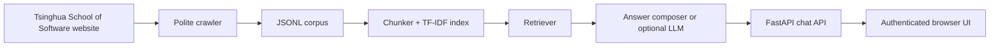

# TKE RAG Challenge

Authenticated RAG chatbot for the TKE Interview Lab challenge. The app crawls and indexes the Tsinghua School of Software website, serves a login-protected chat UI, retrieves relevant source chunks, and answers with citations.

## Stack

- Python 3.10
- FastAPI + Uvicorn
- BeautifulSoup crawler with polite rate limiting
- scikit-learn TF-IDF character n-gram retrieval
- Optional OpenAI-compatible generation when `OPENAI_API_KEY` is set
- Extractive answer composer fallback when no LLM key is configured
- Static HTML/CSS/JS frontend
- Nginx + systemd deployment on `123.59.90.15:8443`

## Architecture



## Local Setup

```bash
python -m venv .venv
.venv\Scripts\activate
python -m pip install --upgrade pip
python -m pip install -r requirements.txt
copy .env.example .env
```

Edit `.env`, then create the corpus and index:

```bash
python -m scripts.crawl --seeds-from html/questions.html --out data/corpus.jsonl --delay 0.75 --max-pages 900
python -m scripts.build_index --corpus data/corpus.jsonl --out data/index
```

Run the app:

```bash
uvicorn app.main:app --host 127.0.0.1 --port 8000
```

Open `http://127.0.0.1:8000`.

## Tests

```bash
pytest -q
```

## Deployment

The committed deployment assets are templates only. Do not commit real server passwords or production `.env` files.

On the target Ubuntu host, the app runs from `/opt/rag-challenge`, with systemd service `rag-challenge.service` and Nginx reverse proxy on `8443`. The existing challenge pages are kept under `/challenge/` for reference while `/` serves the chatbot.

## Configuration

Required:

- `APP_USERNAME`
- `APP_PASSWORD`
- `SESSION_SECRET`

Optional:

- `OPENAI_API_KEY`
- `OPENAI_MODEL`
- `RAG_TOP_K`
- `RAG_MAX_CONTEXT_CHARS`

When no OpenAI key is present, the app still answers by composing a concise extractive response from retrieved source chunks.
